# Aircraft Tagging

> Version 2019-09-04

## Geometry

Planes in the imagery should be identified with 5-points polygons. For planes, polygons should be drawn with the following method:

- Point 1 = aircraft nose
- Point 2 = right wing
- Point 3 and 4 = tail
- Point 4 or 5 = left wing

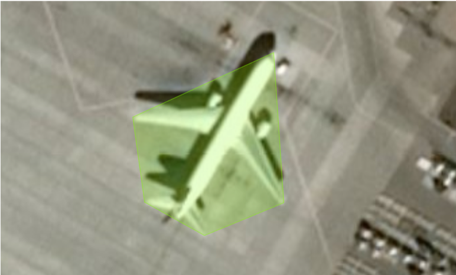

For helicopters, the five points should be as follows:

- Point 1 = tail
- Point 2, 3, 4, 5 = end of each blade

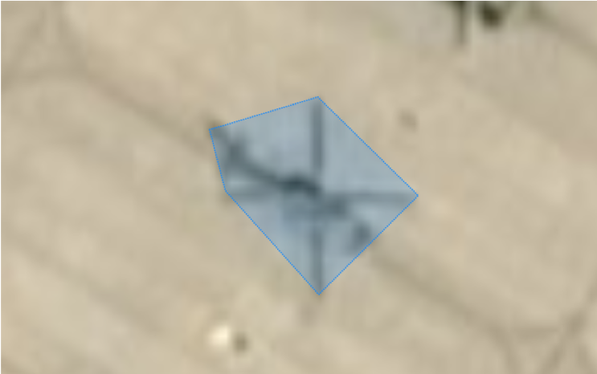

In some cases, you might need to use more than 5 points. *The main objective is to make sure that the polygon encompass the whole aircraft*.

## Classes

The aircraft should be classified into the following 6 categories:

- **small_aircraft** : light aircrafts for leisure, private jets and small passengers aircrafts. Most of these aircrafts have propellers or only one reactor.

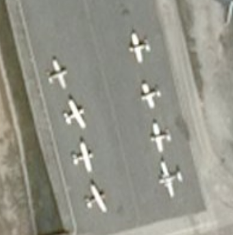

- **large_commercial** : large aircrafts from commercial companies carrying passenger or fret. Main manufacturers are Airbus and Boing. Most common commercial aircrafts are manufactured by Airbus (A320, A340, A380) and Boeing (B737, B747, B777). They mostly have two or four reactors but some have three (McDonnell Douglas DC-10).

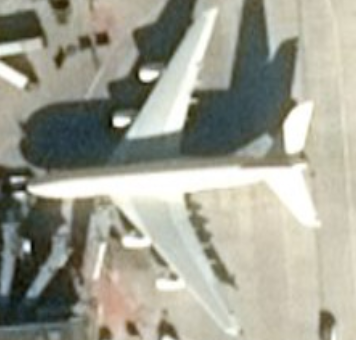

- **helicopter** : all types including military, non-militayr, simple or double rotors

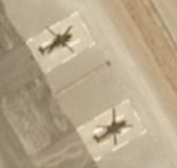

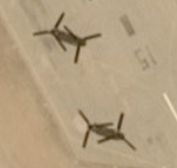

- **fighters** : combat aircrafts, military fighters, military jets

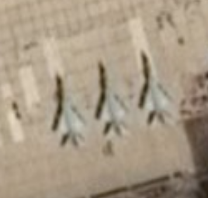

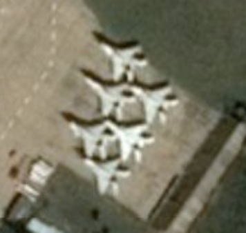

- **bombers** : military bombers. They typically have large wingspan, four reactors, thin bulk

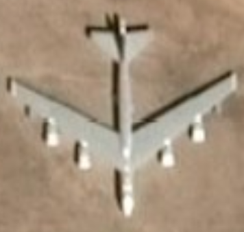

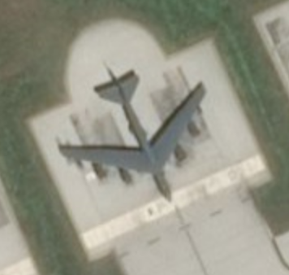

- **other_large_military** : all other large military planes like military transport planes and AWACS. They typically have large bulk to carry tanks or other military equipment. Their shapes are very similar to these of commercial aircrafts.

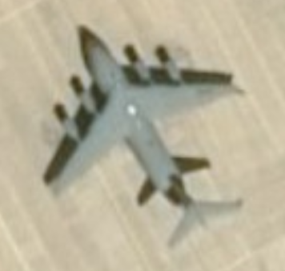

## Important notes

The length and wingspan of aircrafts and helicopters should be **larger than 10 pixels**.

If you encounter objects on the tarmac that might be aircrafts but do not fall in the previous categories, please tag them as **unknown_aircraft**.

**Discard** any aircraft that is truncated at the border of the imagery. **Do not discard** an aircraft that is not fully visible for other reasons (i.e. partially covered by a shed).
