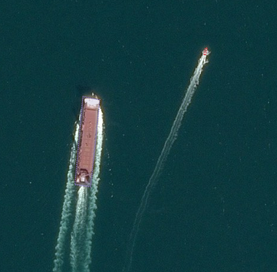

# Ships Tagging in Harbours on Pléiades HR imagery

 > Version 2020-05-04

## Geometry

This project aims to tag **ships** in satellite images, using PHR RGB imagery (spatial resolution of 0,5 meters).

Records should be annotated as an **oriented bounding-box** (with orientation going from back to front of ship) or as a rectangle i.e. a **4-vertices polygon**. 

 
    

## Classes

Every record should be classified as ship.

It is mandatorly expected to also classify the type of ship at level 2, along the following taxonomy:
Insert image
Examples

Find below some examples of ships that can be encountered:

## Notes

Please, do label truncated ships at the border of the imagery.

When ships are moored alongside, they should be labelled individually. As an example, this image contains xx ships.

